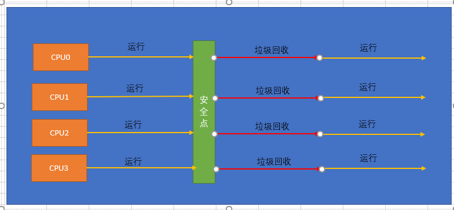

# 垃圾回收
## 如何判断对象可以回收

### 引用计数法

- 对象每次被引用时,计数器加一,但如果两个引用互相引用,导致两个对象都无法回收.

### 可达性分析算法

- 可达性分析判断
    - Java虚拟机中的垃圾回收器采用可达性分析来探索所有存活的对象
    - 扫描堆中的对象,看是否能沿着GC Root对象为七点的引用链找到该对象,找不到则可回收

- GC Root
    - 方法区中的静态变量和常量引用的对象
    - 本地方法栈中JNI本地方法的引用对象
    - 虚拟机栈:栈帧中的本地变量引用的对象

### 四种引用

- 强软弱虚四种引用
    - 强引用(StrongReference)
        - 只有所有GC Roots对象都不通过[强引用]引用该对象,该对象才能被回收
    - 软引用(SoftReference)
        - 仅有软引用引用该对象时,在垃圾回收后,内存仍不足时会再次触发垃圾回收,回收软引用对象
        - 可以配合引用队列来释放软引用自身
    - 弱引用(WeakReference)
        - 仅有软引用引用该对象时,在垃圾回收时,无论内存是否重组,都会回收弱引用对象
        - 可以配合引用队列来释放弱引用自身
    - 虚引用(PhantomReference)
        - 必须配合引用队列使用,主要配合ByteBuffer使用,被引用对象回收时,会将虚引用入队,由ReferenceHandler线程调用虚引用相关方法释放直接内存
- 终结器引用
    - 无需手动编码,但其内部配合引用队列使用,在垃圾回收时,终结器引用入队(被引用对象暂时没有被回收),再由 Finalizer 线程通过终结器引用找到被引用对象并调用它的 finalize 方法,第二次 GC 时才能回收被引用对象

- 代码
    - com.weiliai.reference.*

## 垃圾回收算法

### 标记清除
- Mark Sweep
    - 速度较快

### 标记整理
- Mark Compact
    - 速度慢
    
### 复制算法
- Copy
    - 不会有内存碎片
    - 需要占用双倍内存空间

### 分代垃圾回收

- 分代垃圾回收
    - 对象首先分配在伊甸园区域
    - 新生代空间不足时,触发minor gc,伊甸园和from存活的对象使用copy复制到to中,存活对象年龄加一并且交换from to
    - minor gc会引发STW,暂停其他用户的线程,等垃圾回收结束,用户线程才回复运行
    - 当对象寿命超过阀值时,会晋升至老年代,最大寿命15(4bit)
    - 当老年代空间不足,会先尝试触发minor gc,如果之后空间仍不足,那么触发full gc,STW的时间更长
    
#### 相关VM参数

<table>
    <tr>
        <td>说明</td>
        <td>参数</td>
    </tr>
    <tr>
        <td>堆初始大小</td>
        <td>-Xms</td>
    </tr>
    <tr>
        <td>堆最大大小</td>
        <td>-Xmx或-XX:MaxHeapSize=size</td>
    </tr>
    <tr>
        <td>新生代大小</td>
        <td>-Xmn或(-XX:NewSize=size + -XX:MaxNewSize=size)</td>
    </tr>
    <tr>
        <td>幸存区比例(动态)</td>
        <td>-XX:InitialSurvivorRatio=ratio 和 -XX:+UseAdaptiveSizePolicy</td>
    </tr>
    <tr>
        <td>幸存区比例</td>
        <td>-XX:SurvivorRatio=ratio</td>
    </tr>
    <tr>
        <td>晋升阈值(动态)</td>
        <td>-XX:MaxTenuringThreshold=threshold</td>
    </tr>
    <tr>
        <td>晋升详情</td>
        <td>-XX:+PrintTenuringDistribution</td>
    </tr>
    <tr>
        <td>GC详情</td>
        <td>-XX:+PrintGCDetails -verbose:gc</td>
    </tr>
    <tr>
        <td>FullGC 前 MinorGC</td>
        <td>-XX:+ScavengeBeforeFullGC</td>
    </tr>
</table>

## 垃圾回收器
- 串行
    - 单线程
    - 堆内存较小,适合个人电脑
- 吞吐量优先
    - 让单位时间内,STW的时间最短 0.2 + 0.2 = 0.4,垃圾回收时间占比最低,这样就称吞吐量高
- 响应时间优先
    - 多线程
    - 堆内存较大,多核CPU
    - 尽可能让单次STW的时间最短 0.1 + 0.1 + 0.1 + 0.1 + 0.1 =0.5

### 串行

> -XX:+UseSerialGC = Serial + SerialOld

### 吞吐量优先

> -XX:+UseParallelGC ~ -XX:+UseParallelOldGC
> -XX:GCTimeRatio=ratio
> -XX:MaxGCPauseMillis=ms
> -XX:ParallelGCThreads=n

### 响应时间优先

> -XX:+UseConcMarkSweepGC ~ -XX:+UseParNewGC ~ SerialOld
> -XX:ParallelGCThreads=n ~ -XX:ConcGCThreads=threads
> -XX:CMSInitiatingOccupancyFraction=percent
> -XX:+CMSScavengeBeforeRemark

## 垃圾回收调优